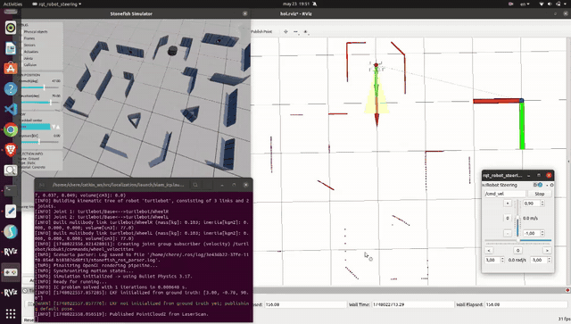
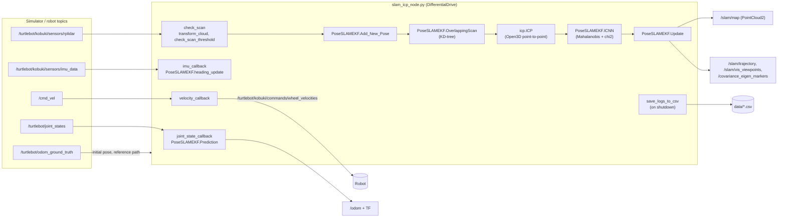
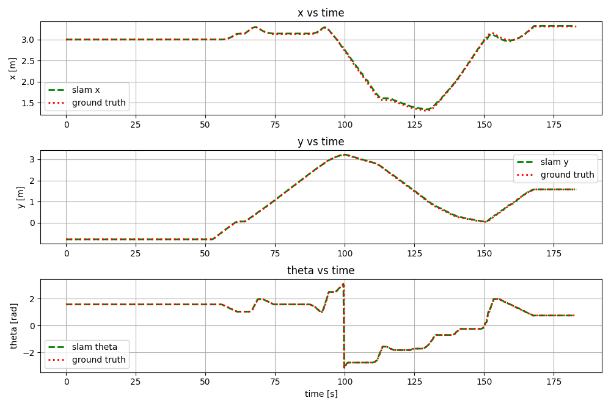
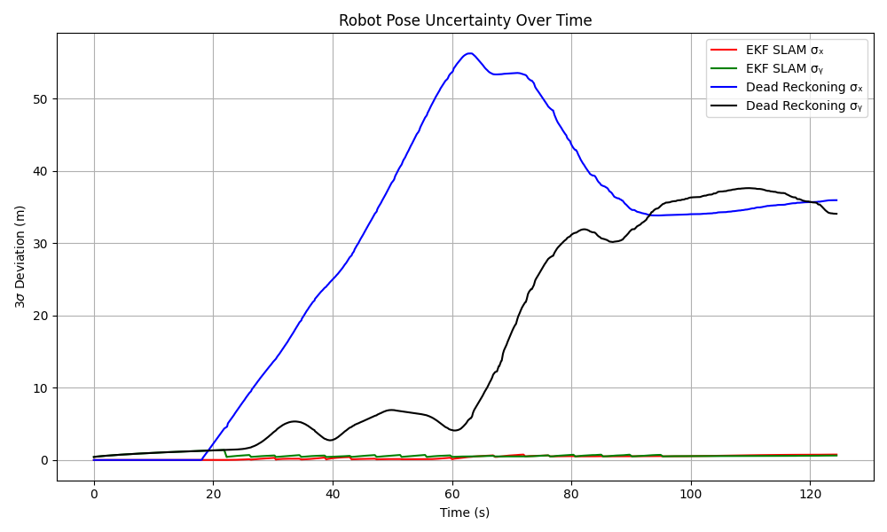

# Pose-Based EKF SLAM with ICP Scan Matching

Pose-based Extended Kalman Filter SLAM for a differential-drive TurtleBot (ROS Noetic). Wheel odometry and IMU heading drive the prediction, and ICP registration between 2D LiDAR scans corrects the pose.

[](https://github.com/Rudip1/pekf-slam-icp/actions/workflows/ci.yml)



## Problem and key result

Dead reckoning from wheel encoders drifts without bound. This package keeps a state vector of every pose where a scan was stored. When the robot comes back near an earlier viewpoint, the two scans are aligned with ICP. Each ICP result is a relative-pose measurement, gated with an individual-compatibility (chi-squared) test and fused with an EKF update.

On the run logged in [`data/`](data) (Stonefish simulation, 48.2 s, 3.6 m of ground-truth path), [`tools/evaluate_logs.py`](tools/evaluate_logs.py) reports:

| Metric | Value |
|---|---|
| Position RMSE vs. ground truth | **0.013 m** |
| Maximum position error | 0.026 m |
| Final position error | 0.016 m |
| Yaw RMSE | 0.34° |
| Final 3σ (x, y), EKF SLAM | 0.29 m, 0.86 m |
| Final 3σ (x, y), dead reckoning (prediction only, no IMU or ICP updates) | 26.43 m, 13.98 m |

## Architecture

The structure below is taken from `src/slam_icp_node.py` and `src/utils_script/`.



`launch/slam_icp.launch` also starts `laser_scan_to_point_cloud_node.py` (LaserScan to `/cloud_in`), `octomap_server`, `rqt_robot_steering` and RViz with `config/slam.rviz`.

## Tested versions

Verified by running the CI steps in a local `ros:noetic` container:

| Component | Version |
|---|---|
| Ubuntu | 20.04 (container) |
| ROS | Noetic |
| Python | 3.8.10 |
| Open3D | 0.19.0 (pip) |
| NumPy / SciPy | 1.24.4 / 1.10.1 (pulled in by Open3D) |
| colcon-common-extensions | latest from PyPI |

## Install

These steps match [`.github/workflows/ci.yml`](.github/workflows/ci.yml). They have been run in a `ros:noetic` container: build, import test and log evaluation pass.

```bash
mkdir -p ~/ws/src && cd ~/ws/src
git clone https://github.com/Rudip1/pekf-slam-icp.git localization
cd ~/ws
sudo apt-get install -y python3-pip libgl1 libgomp1
python3 -m pip install colcon-common-extensions
rosdep update
rosdep install --from-paths src --ignore-src -y --rosdistro noetic
source /opt/ros/noetic/setup.bash
colcon build
python3 -m pip install -r src/localization/requirements.txt   # Open3D
source install/setup.bash
```

`catkin build` / `catkin_make` also work because this is a plain catkin package.

## Run

### Evaluate the recorded run (verified)

```bash
python3 src/localization/tools/evaluate_logs.py      # prints the table above
python3 src/localization/src/plot_three_sigma.py     # 3-sigma plot from data/three_sigma_log.csv
```

### Run the full SLAM pipeline in simulation (not verified here)

`launch/slam_icp.launch` includes `turtlebot_simulation/launch/kobuki_motion_planning.launch`. That package is not public and not part of this repository.

- TODO: name the source of `turtlebot_simulation` or provide a replacement scene.

It also needs the [Stonefish](https://github.com/patrykcieslak/stonefish) simulator and [stonefish_ros](https://github.com/patrykcieslak/stonefish_ros). When those are in the workspace:

```bash
roslaunch localization slam_icp.launch
```

Drive the robot with the `rqt_robot_steering` window. When you stop the launch (Ctrl+C), the node writes `slam_icp_log.csv`, `ground_truth_log.csv` and `three_sigma_log.csv` to the package's `data/` folder.

## Results

| | |
|---|---|
|  |  |
| x, y and θ of the SLAM estimate and the ground truth over a longer run | 3σ position uncertainty of EKF SLAM and of dead reckoning |
|  |  |
| Viewpoints and covariance ellipses after a loop | RViz view of the map with the estimated trajectory |

The two plots above come from recorded runs that are not stored in `data/`. Only the numbers in the key-result table can be reproduced from this repository.

Other figures in [`media/`](media): `architecture.png` (block diagram), `env_map.png` (simulation scene), `aligned.png`, `misaligned.png`, `state_initialization.png`, `covariance_initialization.png` (RViz screenshots).

`data/dr_imu_log.csv` is a dead-reckoning (odometry + IMU) log from a separate run. No script in this repository writes it.

## Repository layout

```
├── CMakeLists.txt, package.xml   catkin package "localization"
├── config/                       RViz configurations
├── data/                         CSV logs of a recorded run
├── launch/
│   ├── slam_icp.launch           main launch file (slam_icp_node.py)
│   ├── test.launch               same, with the earlier test_node.py
│   └── turtlebot.launch          minimal variant with test_node.py
├── media/                        figures and demo GIF
├── src/
│   ├── slam_icp_node.py          ROS node: EKF SLAM, visualisation, CSV logging
│   ├── test_node.py              earlier node without the 3-sigma / dead-reckoning log
│   ├── plot_three_sigma.py       plot data/three_sigma_log.csv
│   └── utils_script/
│       ├── ekf_pose_slam.py      PoseSLAMEKF filter
│       ├── icp.py                Open3D ICP wrapper
│       ├── pose.py               SE(2) compounding and Jacobians
│       ├── helper.py             scan/map/transform helpers
│       └── laser_scan_to_point_cloud_node.py
├── tools/evaluate_logs.py        error metrics from data/
└── .github/workflows/ci.yml      colcon build + import test
```

## Known limitations

- The robot's start pose is taken from the simulator ground-truth topic, and ground truth is required for the comparison logs.
- `OverlappingScan` gets its distance and scan-count arguments in a different order from its signature. This is left unchanged and marked with a TODO in the code.
- Hardware tests on a physical TurtleBot are not documented in this repository yet (TODO).

## Acknowledgements

Developed by **Pravin Oli** and **Gebrecherkos G.**

Simulation uses [Stonefish](https://github.com/patrykcieslak/stonefish) and [stonefish_ros](https://github.com/patrykcieslak/stonefish_ros) by Patryk Cieślak. Scan registration uses [Open3D](https://www.open3d.org/).

## License

[Apache License 2.0](LICENSE). Citation metadata is in [CITATION.cff](CITATION.cff).
